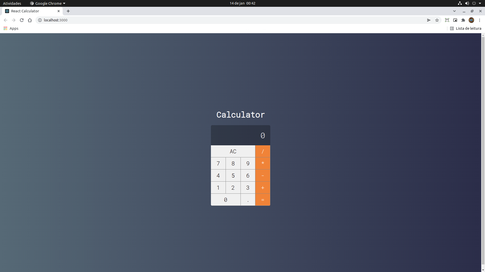

Project realized during the course: "Curso Web Moderno Completo - by Cod3r Cursos Online / Leonardo Moura Leitão"

- Refactored to Functional Components and CSS Modules
- React Basics
- Hooks (useState)

